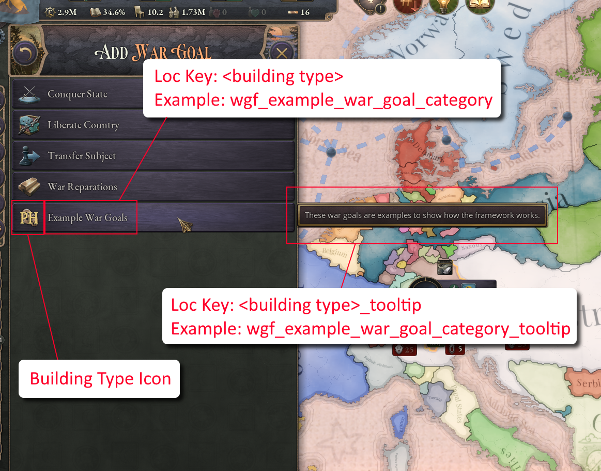

# Overview
**War Goal Framework** is a mod for Victoria 3.

**THIS MOD IS IN ALPHA AND UNFINISHED!**

## Caveats / Limitations

 - You cannot add War Goals to an existing category
 - Custom Diplomatic Plays need to have a base game War Goal attached, and custom war goals can only be added additionally. I recommend using War Reparations as a base War Goal and then attaching your custom War Goal to that. 

## Add a War Goal Category

**Custom War Goals need to be part of a custom category.**

To create a custom War Goal Category, you will need to create
a new building type that represents the category (See [wgf_example_war_goals.txt](mod/common/buildings/wgf_example_war_goals.txt)):

 - The building icon will be the icon used in the War Goal list
 - Make sure the building is not shown to the user (potential trigger)

There are a few localization keys needed to make the category show up correctly (See [wgf_example_war_goal_l_english.yml](mod/localization/english/wgf_example_war_goal_l_english.yml)):

 - \<building type\>: Category name shown in the War Goal list
 - \<building type\>_type_name: Internal category name used to connect the category with a War Goal
 - \<building type\>_tooltip: Tooltip shown when hovering over the category in the War Goal list

Also, there needs to be a corresponding Scripted GUI that determines whether to show or hide the category (See [wgf_example_war_goal_sguis.txt](mod/common/scripted_guis/wgf_example_war_goal_sguis.txt))

 - The name of the scripted gui needs to be the same as the corresponding building type
 - Scope needs to be diplomatic_play
 - The is_shown trigger will decide whether to show or hide the category
 - The following scopes are available for use in the trigger:
   - scope:war_goal = building type that represents the war goal
   - scope:target = diplomatic play target
   - scope:initiator = diplomatic play initiator

Finally, we need to add the category to the global list of custom War Goal Categories `wgf_custom_war_goals_types`:
```
add_to_global_variable_list = {
    name = wgf_custom_war_goals_types
    target = bt:wgf_example_war_goal_category
}
```
**NOTE: I recommend doing this in the global history file** (See [00_activate_example_war_goal.txt](mod/common/history/global/00_activate_example_war_goal.txt)).

## Add a War Goal

**Custom War Goals need to be part of a custom category.**

To create a custom War Goal, you will need to create
a new building type that represents the War Goal (See [wgf_example_war_goals.txt](mod/common/buildings/wgf_example_war_goals.txt)):

- The building icon will be the icon used in the War Goal list
- Make sure the building is not shown to the user (potential trigger)

There are a few localization keys needed to make the category show up correctly (See [wgf_example_war_goal_l_english.yml](mod/localization/english/wgf_example_war_goal_l_english.yml)):

- \<building type\>: War Goal name shown in the War Goal list
- \<building type\>_type_name: Internal category name used to connect the category with a War Goal
- \<building type\>_tooltip: Tooltip shown when hovering over the category in the War Goal list
- \<building type\>_effects_desc: Effect shown in the Diplomatic Play panel when hovering the War Goal

Also, there needs to be a corresponding Scripted GUI that determines whether to show or hide the War Goal (See [wgf_example_war_goal_sguis.txt](mod/common/scripted_guis/wgf_example_war_goal_sguis.txt))

- The name of the scripted gui needs to be the same as the corresponding building type
- Scope needs to be diplomatic_play
- The is_shown trigger will decide whether to show or hide the category
- The following scopes are available for use in the trigger:
    - scope:war_goal = building type that represents the war goal
    - scope:target = diplomatic play target
    - scope:initiator = diplomatic play initiator

Finally, we need to add the War Goal to the global list of custom War Goals `wgf_custom_war_goals`:
```
add_to_global_variable_list = {
    name = wgf_custom_war_goals
    target = bt:wgf_example_war_goal
}
```
**NOTE: I recommend doing this in the global history file** (See [00_activate_example_war_goal.txt](mod/common/history/global/00_activate_example_war_goal.txt)).

## Example Screenshots


